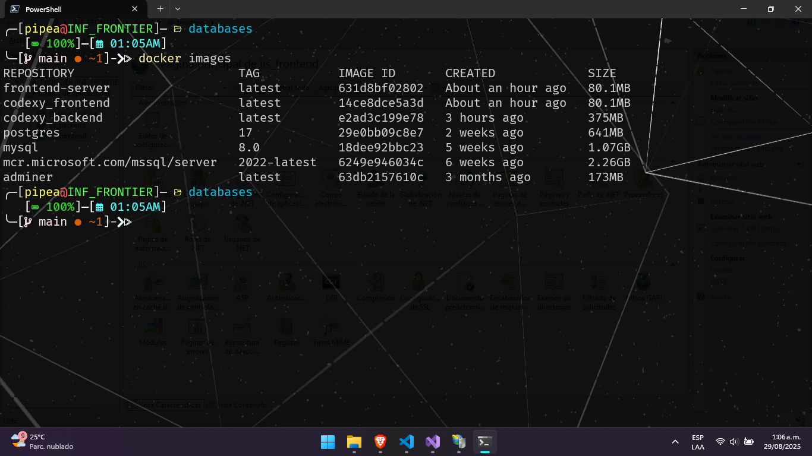

# Evidencias de Despliegue - Aplicación Angular con API .NET

## Descripción del Proyecto

Este documento presenta las evidencias del despliegue exitoso de una aplicación Angular que consume una API Web desarrollada en .NET. El despliegue se realizó utilizando dos enfoques diferentes:

- **Docker**: Contenedorización de los servicios
- **IIS**: Despliegue tradicional en Internet Information Services

---

## 📋 Configuración Inicial

### Imágenes Disponibles Docker

Visualización de las imágenes Docker creadas para el proyecto, mostrando tanto la imagen del backend (.NET) como la del frontend (Angular).

  

---

### Containers Disponibles Docker

Lista de contenedores Docker disponibles en el sistema, preparados para el despliegue de la aplicación.

  

---

### Servicio de Base de Datos SQL Server

Configuración y estado del servicio de SQL Server, mostrando que la base de datos está activa y disponible para las conexiones de la aplicación.

  

---

## 🐳 Sección Docker

### Contenedores en Ejecución

Contenedores tanto del backend como del frontend ejecutándose correctamente en Docker con sus respectivos puertos asignados:

- **Backend**: Puerto 7070
- **Frontend**: Puerto 4203

  

---

### Prueba Backend - Swagger Local

Verificación del funcionamiento del backend a través de Swagger UI, accediendo desde el navegador local para confirmar que la API responde correctamente.

  

---

### Prueba Frontend - Interfaz Local

Prueba de funcionalidad del frontend Angular accediendo a la interfaz del modelo de seguridad desde el navegador local, confirmando la correcta comunicación con la API.

  

---

### Prueba Backend - Swagger Móvil (IP)

Verificación del backend desde un dispositivo móvil utilizando la dirección IP del servidor, accediendo a través de Swagger para confirmar la conectividad externa.

  

---

### Prueba Frontend - Interfaz Móvil (IP)

Acceso a la aplicación Angular desde un dispositivo móvil utilizando la dirección IP, verificando que la interfaz se carga correctamente y mantiene la funcionalidad completa.

  

---

## 🌐 Sección IIS

### Configuración Backend IIS

Configuración de la aplicación backend en IIS, destacando la asignación del puerto 7069 y la correcta configuración del pool de aplicaciones.

  

---

### Configuración Frontend IIS

Configuración de la aplicación frontend en IIS, mostrando la asignación del puerto 4201 y los ajustes necesarios para servir la aplicación Angular.

  

---

### Prueba Backend - Swagger Local IIS

Verificación del funcionamiento del backend desplegado en IIS a través de Swagger UI, confirmando que la API responde correctamente en el puerto 7069.

  

---

### Prueba Frontend - Interfaz Local IIS

Prueba de la aplicación Angular desplegada en IIS, accediendo localmente al puerto 4201 para verificar la correcta carga de la interfaz y funcionalidad.

  

---

### Prueba Backend - Swagger Móvil IIS (IP)

Verificación del backend desplegado en IIS desde un dispositivo móvil, utilizando la dirección IP del servidor para confirmar el acceso externo a la API.

  

---

### Prueba Frontend - Interfaz Móvil IIS (IP)

Acceso final a la aplicación Angular desplegada en IIS desde un dispositivo móvil, confirmando que tanto la interfaz como la comunicación con la API funcionan correctamente desde dispositivos externos.

  

---

## 📊 Resumen de Configuraciones

| Método de Despliegue | Backend | Frontend | Estado |
|---------------------|---------|----------|--------|
| Docker | Puerto 7070 | Puerto 4203 | ✅ Operativo |
| IIS | Puerto 7069 | Puerto 4201 | ✅ Operativo |

---

## 🔧 Tecnologías Utilizadas

- **Frontend**: Angular
- **Backend**: .NET Web API
- **Base de Datos**: SQL Server
- **Contenedorización**: Docker
- **Servidor Web**: IIS (Internet Information Services)

---

## ✅ Conclusión

Se ha completado exitosamente el despliegue de la aplicación en ambos entornos (Docker e IIS), verificando:

1. ✅ Conectividad local en ambos métodos de despliegue
2. ✅ Acceso externo desde dispositivos móviles
3. ✅ Comunicación correcta entre frontend y backend
4. ✅ Funcionamiento de la base de datos SQL Server
5. ✅ Respuesta adecuada de todos los servicios

El proyecto demuestra una implementación robusta y versátil, capaz de ejecutarse tanto en contenedores Docker como en servidores IIS tradicionales.